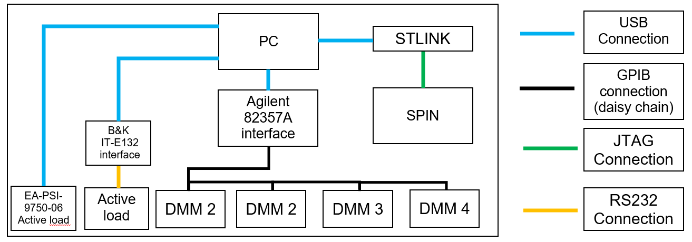
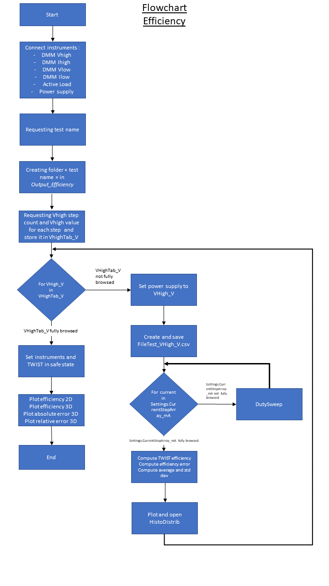

# Converter characterization
This repository contains the scripts used to characterize a DC DC converter. It is organized with one file per inteded characterization, i.e Coefficients.py is to get the calibration coefficients, Efficiency.py is to measure the efficiency of the converter, Accuracy.py to measure the accuracy of the sensors.
The readme is organized per inteded characterization. The first section is about obtaining the calibration coefficients. The second section is about the efficiency, the third one about the accuracy.

## Getting started
The scripts are developped to run under windows 10.
Other windows distributions have not been tested.

## Setup
The setup is identical for all the characterization.

### Setup : instruments
One power supply, four DMMs (Digital MultiMeter), one active load and one STLINKV3 debugger are used in the setup.

#### Setting the operating point
 - Power supply : 1 EA-PSI-9750-06
 - Active load : 1 ITECH IT8512B and a RS232 to USB interface B&K IT-E132
 - Debugger : 1 STLINKV3
note : on the actual version auto-detection of COM PORT is disabled. So for proper work, please set the correct COM Port of each instrument in the Settings.py file. Information can be found in "Ports" section of device manager of windows

#### Measuring input and output voltages and currents
 - Digital Multimeters : 4 KEITHLEY K2000 and a GPIB Interface KEYSIGHT 82357A
 - Current sensing : 2 15FR010E 5W, 10mOhm +/- 1% precision current sensing resistor

A computer with windows 10 is used to run the script and collect the data.

The test setup is the following :


### Setup : communication

Communication architecture is the following :



### Instruments setup
The load and the DMM must have settings set via the hardware control panel.
They are the following : 

- Active load : 
Menu -> Config -> Address ser -> address = 0
Make sure the serial communication parameters are set the following :
baudRate = 9600
bytesize = 8
parity = "N"
stopbits = 2

- DMM :
All the DMM should be configured in SCPI communication mode. To do so, go to front panel and type the buttons : 

Shift -> GPIB -> GPIB -> ON 
Shift -> GPIB -> LANG -> SCPI

As each DMM has a specific function (read current low, high, voltage low and high), every DMM should have a specific address.

To change the address :

Shift -> GPIB -> Address

The following array describes the addresses according to the function :

|               Function               | Address |
|:------------------------------------:|:-------:|
| IHighResource (voltage across shunt) |    1    |
|             VHighResource            |    2    |
|             VLowResource             |    3    |
|  ILowResource (voltage across shunt) |    4    |

### Firmware
Before running the script, make sure the board under test (BUT) is flashed with the code in the core folder.

A procedure detailing how to flash the BUT is available :
https://gitlab.laas.fr/owntech/tutorials/-/wikis/Getting-Started-1-Blinky

### Python
To run, the script need python 3 (older versions have not been tested)
Make sure you install python from official website. Issues were encountered when python was installed from windows store.
Official website URL : https://www.python.org/
At python installation, check the box to add python to PATH.

### Requirements
With a terminal, go to the root of the repository and type the line
```pip install -r requirements.txt```

### Pyvisa
Pyvisa is a module listed in the requirements.txt file.
But it needs a VISA API installed on your computer. To do so, follow the tutorial: 
https://pyvisa.readthedocs.io/en/latest/introduction/getting.html

### Driver
To communicate, load and DMM requires extra hardware with specific drivers

- Driver for active load : B&K IT-E132 RS232/USB interface.
The windows 10 driver files are available in the IT-E132_Driver folder. 
You will find an installation procedure in Doc/IT-E132_Install_Driver document.

- Driver for power supply : it should automatically be installed when the power supply is connected.

## Known issues
The following issues are know and a way of handle them is given.
- B&K IT-E132 RS232/USB interface driver can randomly uninstall (especially when rebooting). Install it back (see procedure above).
- At the start of script, DMM can send back an error. Power it off then on and restart the script
- COM port of instrument can change, especially if deconnected and reconnected. Set back the correct COM PORT in settings.py

Now you are all set, you can start using the scripts ! We now describe how to run each script and what they produce.

## Coefficients
This script is intended to compute the calibration coefficients.

### How to run
With a terminal, go to the root of the repository and type the line
```python Coefficients.py```

You will the be guided by the script to type the test settings (test name, configuration,...). 
Just interact with the terminal !

### Flowchart
This python script handles multiple test instruments in order to compute calibration coefficients of the converter.
The flowchart of the script is the following :


### Output folder structure
The script generates its output in the folder 'Output_Coefficients' created at the root of the script folder.

### Outupt of the script
Each time the script is run, following folder/files are created into the Output_Coefficients folder : 
- one folder named "BoardSN"
- Inside this "BoardSN" folder, 4 files are created : VHigh.csv, IHigh.csv, VLow(x).csv, ILow(x).csv


Each time the script is run, the file Coeffs.csv is also appended with a new line (under the last line). The first column of this new row contains the "BoardSN".

### Custom test
In the Settings.py file, variables can be changed to customize the test. 
The variable and its description are now listed

|              Variable              |                                 Description                                |
|:----------------------------------:|:--------------------------------------------------------------------------:|
|       CoeffNumberOfTWISTMeas       |         The number of twist averaged twist samples for each measure        |
| CoeffVHighCalibrationDutyPercent   | The duty cycle for the calibration of VHigh                                |
| CoeffVHighCalibrationLowCurrent_mA | The current drawn on low side for the calibration of VHigh                 |
| CoeffIHighCalibrationDuty_Percent  | The duty cycle for the calibration of IHigh                                |
| CoeffIHighCalibrationVHigh_mV      | The VHigh value for the calibration of IHigh                               |
| CoeffVLowCalibrationLowCurrent_mA  | The current drawn on low side for the calibration of VLow                  |
| CoeffVLowCalibrationVHigh_mV       | The VHigh value for the calibration of VLow                                |
| CoeffILowCalibrationDuty_Percent   | The duty cycle for the calibration of ILow                                 |
| CoeffILowCalibrationVHigh_mV       | The VHigh value for the calibration of ILow                                |
| CoeffStepMinVHigh_mV               | The minimal value of VHigh for the VHigh calibration                       |
| CoeffStepMaxVHigh_mV               | The maximal value of VHigh for the VHigh calibration                       |
| CoeffNumberOfVHighStep             | The number of VHigh steps for the VHigh calibration                        |
| CoeffStepMinCurrent_mA             | The minimal value of ILow for the ILow/IHigh calibration (value is shared) |
| CoeffStepMaxCurrent_mA             | The maximal value of ILow for the ILow/IHigh calibration (value is shared) |
| CoeffNumberOfCurrentStep           | The number of Ilow steps for the VHigh calibration                         |

## Efficiency
We now describe the process for the characterization of the efficiency of the converter:

### How to run
With a terminal, go to the root of the repository and type the line
```python Efficiency.py```

You will then be guided by the script to type the test settings (test name, configuration,...). Simply interact with the terminal !

### Flowchart
This python script handles multiple test instruments in order to assess efficiency of power converters.
The flowchart of the script is the following : 



### Output folder structure
The script generates its output in the folder 'Output_Efficiency' created at the root of the script folder.

### Outupt of the script
The script generates the following files: 

|           File           |                                             Description                                             |
|:------------------------:|:---------------------------------------------------------------------------------------------------:|
|    testname_VHigh.csv    | csv file containing every variable monitored during the test                                        |
|  testname_VHigh_AVGD.csv | csv file containing variable monitored, averaged with the value NumberOfpointsPerDuty (settings.py) |
|    testname_histo.svg    | svg containing the distribution of every monitored variable                                         |
|    testname_Eff2D.png    | The efficiency on a 2-D projection, it concatenates every VHigh measures of the test                |
|    testname_Eff2D.svg    | Same as above but in svg                                                                            |
|   testname_3d_plot.html  | The efficiency on 3D, it concatenates every VHigh measures of the test                              |
| testname_3d_rel_err.html | The relative error on efficiency measure in 3D                                                      |
| testname_3d_rel_abs.html | The absolute error on efficiency measure in 3D                                                      |

A recap of the output folder is visible:


### Custom test
In the Settings.py file, variables can be changed to customize the test. 
The variable and its  description are now listed

|           Variable          |                                        Description                                       |
|:---------------------------:|:----------------------------------------------------------------------------------------:|
| LoadInternalSafetyCurrent_A | The maximum current the load will accept to sink, in Ampere                              |
|  LoadInternalSafetyPower_W  | The maximum power the load will accept to sink, in Watt                                  |
|    NumberOfpointsPerDuty    | Number of samples read per duty, same for DMM and SPIN                                   |
|      duty_step_Percent      | The step of duty cycle when we send 'u' (or 'd') to SPIN                                 |
| NumberOfStepInDutySweep     | The number of times we increase D for ONE Duty sweep                                     |
| starting_duty_cycle_Percent | The value of duty cycle when we send 'r' to SPIN                                         |
| CurrentStepValue_i_mA       | The value of the current for the step i. A duty sweep is performed for each current step |
|                             |                                                                                          |

## Accuracy
We now describe the process for the characterization of the accuracy of the converter:

### How to run
With a terminal, go to the root of the repository and type the line
```python Accuracy.py```

You will the be guided by the script to type the test settings (test name, configuration,...). 
Just interact with the terminal !

### Flowchart
This python script handles multiple test instruments in order to assess accuracy of the sensors of the power converter.

The sensors measure VHigh, VLow (both legs), IHigh and ILow (both legs).

The flowchart of the script is the following : 


### Output folder structure
The script generates output in the folder 'Output_Accuracy' created at the root of the script folder.

### Outupt of the script
The script generates the following files: 

|               File               |                                   Description                                  |
|:--------------------------------:|:------------------------------------------------------------------------------:|
| TestName_AvgNum_All_Abs.png      | png file containing graph of all absolute errors (VHigh, VLow, IHigh and Ilow) |
| TestName_AvgNum_All_Abs.svg      | svg file containing graph of all absolute errors (VHigh, VLow, IHigh and Ilow) |
| TestName_AvgNum_All_Rel.png      | png file containing graph of all relative errors (VHigh, VLow, IHigh and Ilow) |
| TestName_AvgNum_All_Rel.svg      | svg file containing graph of all relative errors (VHigh, VLow, IHigh and Ilow) |
|  TestName_AvgNum_IHigh_AVGD.csv  | csv file containing the data for the error plot on IHigh measure               |
| TestName_AvgNum_IHigh_AVGD_A.png | png file containing a graph of the absolute error on IHigh measure             |
| TestName_AvgNum_IHigh_AVGD_R.svg | svg file containing a graph of the relative error on IHigh measure             |
|   TestName_AvgNum_ILow_AVGD.csv  | csv file containing the data for the error plot on ILow measure                |
|  TestName_AvgNum_ILow_AVGD_A.png | png file containing a graph of the absolute error on ILow measure              |
|  TestName_AvgNum_ILow_AVGD_R.svg | svg file containing a graph of the relative error on ILow measure              |
|  TestName_AvgNum_VHigh_AVGD.csv  | csv file containing the data for the error plot on VHigh measure               |
| TestName_AvgNum_VHigh_AVGD_A.png | png file containing a graph of the absolute error on VHigh measure             |
| TestName_AvgNum_VHigh_AVGD_R.svg | svg file containing a graph of the relative error on VHigh measure             |
|   TestName_AvgNum_VLow_AVGD.csv  | csv file containing the data for the error plot on VLow measure                |
|  TestName_AvgNum_VLow_AVGD_A.png | png file containing a graph of the absolute error on VLow measure              |
|  TestName_AvgNum_VLow_AVGD_R.svg | svg file containing a graph of the relative error on VLow measure              |                                            |

### Custom test
In the Settings.py file, variables can be changed to customize the test. 
The variable and its according description are now listed

| Variable                         | Description                                                  |
|----------------------------------|--------------------------------------------------------------|
| LoadInternalSafetyCurrent_A      | The maximum current the load will accept to sink, in Ampere  |
| LoadInternalSafetyPower_W        | The maximum power the load will accept to sink, in Watt      |
| NumberOfpointsPerDuty            | Number of samples read per duty, same for DMM and SPIN       |
| duty_step_Percent                | The step of duty cycle when we send 'u' (or 'd') to SPIN     |
| starting_duty_cycle_Percent      | The value of duty cycle when we send 'r' to SPIN             |
| AccVHighCalibrationDutyPercent   | The duty cycle for the VHigh measures, in percent            |
| AccVHighCalibrationLowCurrent_mA | The current sink by the load for the VHigh measures, in mA   |
| AccIHighCalibrationDuty_Percent  | The duty cycle value for the IHigh measures, in percent      |
| AccIHighCalibrationVHigh_mV      | The VHigh value for the IHigh measures, in mV                |
| AccVLowCalibrationLowCurrent_mA  | The current sink by the load for the VHLow measures, in mA   |
| AccVLowCalibrationVHigh_mV       | The VHigh value for the VLow measures, in mV                 |
| AccILowCalibrationDuty_Percent   | The duty cycle value for the ILow measures, in percent       |
| AccILowCalibrationVHigh_mV       | The VHigh value for the ILow measures, in mV                 |
| AccNumberOfStepInVLowDutySweep   | The number of step for VLow measures                         |
| AccNumberOfVHighStep             | The number of VHigh steps for VHigh measures                 |
| AccStepMinVHigh_mV               | The value of the first VHigh step, for VHigh measures, in mV |
| AccStepMaxVHigh_mV               | The value of the last VHigh step, for VHigh measures, in mV  |
| AccIHighNumberOfCurrentStep      | The number of IHigh steps for IHigh measures                 |
| AccIHighStepMinCurrent_mA        | The value of the first IHigh step, for IHigh measures, in mA |
| AccIHighStepMaxCurrent_mA        | The value of the last IHigh step, for IHigh measures, in mA  |
| AccILowNumberOfCurrentStep       | The number of ILow steps for ILow measures                   |
| AccILowStepMinCurrent_mA         | The value of the first ILow step, for ILow measures, in mA   |
| AccILowStepMaxCurrent_mA         | The value of the last ILow step, for ILow measures, in mA    |


## Histogram

This script is intended to create an histogram from a great number of measures.

### Custom test

To run this test, you need to choose the parameters you want to apply. 

- You can set the number of samples to be read per duty cycle (DMM and SPIN). The larger the number of points, the more accurate the resulting histogram will be. However, this will extend the test duration.
- You can also adjust the duty cycle for the VHigh measurements and the current sink by the load for the VHigh measures.
By increasing these parameters, you will increase the voltage and current across the LEGs.
- Enventully, you can choose the voltage values at which you want to take your measurements. However, please note that increasing the number of data points will significantly extend the duration of your test.

### Output folder structure
The script generates output in the folder 'Output_Histogram'.

# Implementation of a new test

## json_DefaultParameters file

- Update this json file and choose explicit and understandable names for your parameters. For reasons of clarity, give the same name for the variables in the json as in the setup file (when you create the card xxxxxx_Test_Parameters).
- Warning: you have to put them at the end and to take of in which order you put them. Indeed, in the callback functions load_parameters and uptade_all_json_data, the parameters of your test have to be in the same order as in the json file.
- Initialize the arrays with "".

## Settings file

Create a variable TestxxxxxxProgress that you initialize to 0. 
This variable will be used to update the progress bar associated with your test in the callback function update_progress in the Setup_page.
Don't forget to update this variable in the script of you test while it is running.
Don't forget to fix the variable progress_bar_max_xxxxxx in the setup_page.

## Setup_page

### Step 1

Paste this code the python file "Setup_page" and adapt it for your test.

```
#####################################################################################
#                                   xxxxxx Test                                     #
#####################################################################################

# creation of the xxxxxx test button
test_xxxxxx = dbc.Button(
                "xxxxxx test", 
                id="test_xxxxxx_button",
                color="danger",
                n_clicks=0,
                ),

# creation of the card that contains the InputTexts to configure the xxxxxx test
xxxxxx_Test_Parameters = dbc.Card(
            [
                dbc.CardHeader(
                    html.A(
                        "xxxxxx test parameters",
                        id="xxxxxx_test_parameters_card_header",
                        className="xxxxxx_test_parameters_card_header",
                        style={"textDecoration": "none", "cursor": "pointer"},
                    )
                ),
                dbc.Collapse(
                    dbc.CardBody(
                        [
                        dbc.Button(html.I(className="fas fa-lightbulb", style={"margin_right": "4px"})
                                   , id="info_test_xxxxxx", outline=True, n_clicks=0),
                        dbc.Modal(
                        [
                            dbc.ModalHeader(dbc.ModalTitle("Information xxxxxx test")),
                            dbc.ModalBody(id="info_test_xxxxxx_modal_content"),
                            dbc.ModalFooter(
                                dbc.Button(
                                    "Close", id="info_test_xxxxxx_modal_close", className="ms_auto", n_clicks=0
                                )
                            ),
                        ],
                        id="info_test_xxxxxx_modal",
                        size="lg",
                        is_open=False,
                        ),
                            dbc.InputGroup(
                                [
                                    dbc.InputGroupText(""),
                                    dbc.Input(id="", valid=False, invalid=False, persistence_type='memory', persistence=True),
                                ]
                            ),
                            html.Div(style={"height": "15px"}),
                            dbc.InputGroup(
                                [
                                    dbc.InputGroupText(""),
                                    dbc.Input(id="", valid=False, invalid=False, persistence_type='memory', persistence=True),
                                ]
                            ),
                            html.Div(style={"height": "15px"}),
                            dbc.InputGroup(
                                [
                                    dbc.InputGroupText("Minimal value"),
                                    dbc.Input(id="xxxxxxParam5Min", valid=False, invalid=False, persistence_type='memory', persistence=True),
                                ]
                            ),
                            dbc.InputGroup(
                                [
                                    dbc.InputGroupText("Maximal value"),
                                    dbc.Input(id="xxxxxxParam5Max", valid=False, invalid=False, persistence_type='memory', persistence=True),
                                ]
                            ),
                            dbc.InputGroup(
                                [
                                    dbc.InputGroupText("Number of steps"),
                                    dbc.Input(id="xxxxxxParam5NumberOfSteps", valid=False, invalid=False, persistence_type='memory', persistence=True),
                                ]
                            ),
                            dbc.Button(
                                "Check",
                                id="check_xxxxxxParameters_button",
                                color="warning"
                            ),                            
                        ]
                    ),
                    id="xxxxxx_test_parameters_card_collapse",
                ),
            ],
            id="xxxxxx_test_parameters_card", color = "", outline = True
        )

# callback that open/close the xxxxxx_test_parameters_card
@callback(
    Output("xxxxxx_test_parameters_card_collapse", "is_open"),
    [Input("xxxxxx_test_parameters_card_header", "n_clicks")],
    [dash.dependencies.State("xxxxxx_test_parameters_card_collapse", "is_open")],
)
def toggle_xxxxxx_test_parameters_collapse(n, is_open):
    if n:
        return not is_open
    return is_open

# callback that updates the xxxxxx_test_parameters_card color
# in this callback, all parameters that belongs to the xxxxxx test have to be present
@callback(
        Output("xxxxxx_test_parameters_card", "color"),

        Input("xxxxxxParam1", "valid"),
        Input("xxxxxxParam2", "valid"),
        Input("xxxxxxParam3", "valid"),
        Input("xxxxxxParam4", "valid"),
        
        Input("xxxxxxParam1", "invalid"),
        Input("xxxxxxParam2", "invalid"),
        Input("xxxxxxParam3", "invalid"),
        Input("xxxxxxParam4", "invalid"),

        Input("xxxxxxParam1", "value"),
        Input("xxxxxxParam2", "value"),
        Input("xxxxxxParam3", "value"),
        Input("xxxxxxParam4", "value"),
        
        Input("TestNamesLoadParameters", "valid")
)
def update_xxxxxxx_test_parameters_card_color(xxxxxxParam1_validity, xxxxxxParam2_validity, xxxxxxParam3_validity,
                                        xxxxxxParam4_validity,
                                        xxxxxxParam1_invalidity, xxxxxxParam2_invalidity, xxxxxxParam3_invalidity,
                                        xxxxxxParam4_invalidity,
                                        xxxxxxParam1_value, xxxxxxParam2_value, xxxxxxParam3_value,
                                        xxxxxxParam4_value,
                                        TestNamesLoadParameters_validity):
    if ((xxxxxxParam1_validity and  xxxxxxParam2_validity and xxxxxxParam3_validity and
                                        xxxxxxParam4_validity) or (TestNamesLoadParameters_validity and not (
                                        xxxxxxParam1_invalidity or  xxxxxxParam2_invalidity or xxxxxxParam3_invalidity or
                                        xxxxxxParam4_invalidity) and 
                                        xxxxxxParam1_value !="" and  xxxxxxParam2_value !="" and xxxxxxParam3_value !="" and
                                        xxxxxxParam4_value !="")):
        return "success"
    return ""

# callback that check the value of xxxxxx test parameters
# write callback like these for every parameters that belongs to your test
@callback(
    Output("xxxxxxParam1", "valid"),
    Output("xxxxxxParam1", "invalid"),
    [Input("xxxxxxParam1", "n_submit"), Input("xxxxxxParam1", "n_blur")],
    State("xxxxxxParam1", "value")
)
def check_xxxxxxParam1_validity(xxxxxxParam1_n_submit, xxxxxxParam1_n_blur, xxxxxxParam1_value):
    if xxxxxxParam1_value and (xxxxxxParam1_n_submit or xxxxxxParam1_n_blur):
        if str(xxxxxxParam1_value).isdigit() and int(xxxxxxParam1_value) >= 1 and int(xxxxxxParam1_value) <= 1000:
            return True, False
        return False, True
    return False, False

# Here is a template of callback for the usual case in which the user have to enter a min value, a max value and a number of points.
@callback(
        Output("xxxxxxParam5Min", "valid"),
        Output("xxxxxxParam5Min", "invalid"),
        Output("xxxxxxParam5Max", "valid"),
        Output("xxxxxxParam5Max", "invalid"),
        Output("xxxxxxParam5NumberOfSteps", "valid"),
        Output("xxxxxxParam5NumberOfSteps", "invalid"),
        Output("check_xxxxxxParam5_button", "color"),
        Output("check_xxxxxxParam5_button", "children"),
        Input("check_xxxxxxParam5_button", "n_clicks"),
        State("xxxxxxParam5Min", "value"),
        State("xxxxxxParam5Max", "value"),
        State("xxxxxxParam5NumberOfSteps", "value")
)
def check_xxxxxxParam5(n, xxxxxxParam5Min_value, xxxxxxParam5Max_value, xxxxxxParam5NumberOfSteps_value):
    if n:
        if xxxxxxParam5Min_value is not None and xxxxxxParam5Max_value is not None and xxxxxxParam5NumberOfSteps_value is not None:
            if ((int(xxxxxxParam5Max_value) > int(xxxxxxParam5Min_value) and int(xxxxxxParam5NumberOfSteps_value) > 1) 
                or (int(xxxxxxParam5Max_value) == int(xxxxxxParam5Min_value) and int(xxxxxxParam5NumberOfSteps_value) == 1) 
                and (str(xxxxxxParam5Min_value).isdigit() and str(xxxxxxParam5Max_value).isdigit() and str(xxxxxxParam5NumberOfSteps_value).isdigit()
                     and int(xxxxxxParam5Max_value)<=96000 and int(xxxxxxParam5Min_value)>=10000 and int(xxxxxxParam5NumberOfSteps_value)<=1000)):
                return True, False, True, False, True, False, "success", "OK"
            return False, True, False, True, False, True, "danger", "Not OK"
        return False, True, False, True, False, True, "danger", "Not OK"
    return False, False, False, False, False, False, "warning", "Check"

# callback that open/close the modal that provides information concerning the test xxxxxx
@callback(
    Output("info_test_xxxxxx_modal", "is_open"),
    [Input("info_test_xxxxxx", "n_clicks"), Input("info_test_xxxxxx_modal_close", "n_clicks")],
    [State("info_test_xxxxxx_modal", "is_open")],
)
def toggle_info_test_xxxxxx_modal(n1, n2, is_open):
    if n1 or n2:
        return not is_open
    return is_open

# callback that display the content of the modal from the file markdown_test_info
@callback(
        Output("info_test_xxxxxx_modal_content", "children"),
        Input("info_test_xxxxxx", "n_clicks")
)
def display_info_test_xxxxxx_modal_content(n):
    if n:
        return dcc.Markdown(markdown_test_info.markdown_test_xxxxxx)

# creation of the progress bar for the xxxxxx test
def calcul_progress_bar_max_xxxxxx():
    global progress_bar_max_xxxxxx
    progress_bar_max_xxxxxx = ...
# initialization of the progress bar maximale value
calcul_progress_bar_max_xxxxxx()

progress_bar_xxxxxxx = html.Div(
    [
        dcc.Interval(id="progress_interval_xxxxxx", n_intervals=0, interval=1000),
        dbc.Progress(id="progress_xxxxxx", value=0, max=progress_bar_max_xxxxxxx),
    ]
)

# callback associated with the evolution of the progress_bar_xxxxxx while the xxxxxx test is running
@callback(Output("progress_xxxxxx", "value"), [Input("progress_interval_xxxxxx", "n_intervals")])
def update_progress(n):
    current_value = Settings.TestxxxxxxProgress
    return current_value

# callback that launch xxxxxx test; update the test_xxxxxx_button and update the test information in the json (JsonTestsHistory_data)
@callback(   
    dash.dependencies.Output("test_xxxxxx_button", "children"),
    [dash.dependencies.Input("test_xxxxxx_button", "n_clicks")],
    [dash.dependencies.State("test_xxxxxx_button", "color"),
     dash.dependencies.State("TestName","value"),
     dash.dependencies.State("LowLeg","value"),
     dash.dependencies.State("BoardSN","value")
     ]
)
def launch_test_xxxxxxx(n, test_xxxxxx_button, TestName, LowLeg, BoardSN):
    if TestName is None or LowLeg is None or BoardSN is None:
        raise PreventUpdate
    if n is None:
        raise PreventUpdate
    else:
        if test_xxxxxxx_button == "success":  

            if "Testxxxxxx" not in Settings.JsonTestsHistory_data["TestsDoneHistory"][TestIndex]:
                Settings.JsonTestsHistory_data["TestsDoneHistory"][TestIndex].append("Testxxxxxx")

            with open("JsonTestsHistory.json", "w") as f:
                json.dump(Settings.JsonTestsHistory_data, f, indent=4)

            xxxxxx.xxxxxx(arguments you need for your test)
            return "xxxxxx test Done"
        else:
            return "xxxxxx test"
```

Here are some instructions to adapt this code for your test:

- Replace "xxxxxx" with the name of your test or an acronym (e.g., "Coeffs" instead of "Coefficients").

- Add your test parameters to the card "xxxxxx_Test_Parameters" with explicit and understandable names.

- Adjust the callbacks that validate the input values for the parameters based with the allowed range for each parameter you want. For instance, you can use the check function template for cases where the user has to enter a minimum value, a maximum value, and the number of points.

- Create your markdown_test_xxxxxx in the file markdown_test_info.

- Define the maximum value for the progress bar associated with the test using the variable "progress_bar_max_xxxxxxx".

- To launch the test in the "launch_test_xxxxxxx" function, call the main function of your test with the required arguments using the format: NameOfThePythonFileOfYourTest.FunctionThatMakesTheTest(ArgumentsOfThisFunction).

### Step 2

Once you have added the adapted part specific to the implemented test, it's essential to proceed with the necessary changes to other parts of the setup_page in order to continue the implementation of the new test.

#### Before the layout

- Import the name of the python file of your test.

```
import xxxxxx
```

- Update the progress_bar_max_test_sequence by adding  the "progress_bar_max_xxxxxx" that refers to your test.

```
progress_bar_max_test_sequence = progress_bar_max_accuracy + progress_bar_max_efficiency + progress_bar_max_coefficients + progress_bar_max_xxxxxx
```

- Add the parameters of your test to the callback function that enables saving all parameters in a JSON when the user clicks on the associated button. Additionally, call the "calcul_progress_bar_max_xxxxxx" function to update the value of the "progress_bar_max_xxxxxx" based on the "xxxxxx" test parameters.

```
@callback(
        Output("save_all_parameters_button", "children"),
        Output("save_all_parameters_button", "color"),
        dash.dependencies.Input("save_all_parameters_button", "n_clicks"),
        dash.dependencies.State("LoadInternalSafetyCurrent_A", "value"),
        dash.dependencies.State("LoadInternalSafetyPower_W", "value"),

        ...

        dash.dependencies.State("xxxxxxParam1", "value"),
        dash.dependencies.State("xxxxxxParam2", "value"),
        dash.dependencies.State("xxxxxxParam3", "value"),
        dash.dependencies.State("xxxxxxParam4", "value"),

        ...

        dash.dependencies.State("TestName", "valid"),
        dash.dependencies.State("BoardSN", "valid"),
        dash.dependencies.State("LowLeg", "valid"),
        dash.dependencies.State("global_parameters_card", "color"),
        dash.dependencies.State("coefficients_test_parameters_card", "color"),
        dash.dependencies.State("efficiency_test_parameters_card", "color"),
        dash.dependencies.State("accuracy_test_parameters_card", "color"),
)
def uptade_all_json_data(n, LoadInternalSafetyCurrent_A_value, LoadInternalSafetyPower_W_value, 
                     ...
                     xxxxxxParam1_value, xxxxxxParam2_value, xxxxxxParam3_value, xxxxxxParam4_value, 
                     ...)
                     TestName_validity, BoardSN_valididy, LowLeg_validity,
                     global_parameters_card_color, coefficients_test_parameters_card_color, efficiency_test_parameters_card_color, accuracy_test_parameters_card_color):
    if n:
        if (TestName_validity and BoardSN_valididy and LowLeg_validity and (global_parameters_card_color, coefficients_test_parameters_card_color, efficiency_test_parameters_card_color, accuracy_test_parameters_card_color)==4*("success", )):
           
            Settings.json_data["LoadInternalSafetyCurrent_A"] = int(LoadInternalSafetyCurrent_A_value)
            Settings.json_data["LoadInternalSafetyPower_W"] = int(LoadInternalSafetyPower_W_value)
            
            ...

            Settings.json_data["xxxxxxParam1"] = int(xxxxxxParam1_value)
            Settings.json_data["xxxxxxParam2"] = int(xxxxxxParam2_value)
            Settings.json_data["xxxxxxParam3"] = int(xxxxxxParam3_value)
            Settings.json_data["xxxxxxParam4"] = int(xxxxxxParam4_value)

            ...

            # update the progress bar
            calcul_progress_bar_max_accuracy()
            calcul_progress_bar_max_coefficients()
            calcul_progress_bar_max_efficiency()
            calcul_progress_bar_max_xxxxxx()

            return "All parameters saved", "success"
    return "Save all parameters", "warning"

```

If you are in the usual case in which the user has to enter a min value, a max value and a number of points; update Settings.json_data using the code below:
```
Settings.json_data["xxxxxxParamMin"] = int(xxxxxxParam5Min_value)
Settings.json_data["xxxxxxParamMax"] = int(xxxxxxParam5Max_value)
Settings.json_data["xxxxxxParamNumberOfSteps"] = int(xxxxxxParamNumberOfSteps_value)
Settings.json_data["xxxxxxParamStepArray"] = np.linspace(Settings.json_data["xxxxxxParamMin"], Settings.json_data["xxxxxxParam5Max"], Settings.json_data["xxxxxxParamNumberOfSteps"])
Settings.json_data["xxxxxxParam5StepArray"] = [round(num, 0) for num in Settings.json_data["xxxxxxParamStepArray"]]
``` 


- Add the parameters of your test in the callback that load exixting parameters from the input TestNamesLoadParameters chosen by the user

```
@callback(
    [
        dash.dependencies.Output("LoadInternalSafetyCurrent_A", "value"),  
        dash.dependencies.Output("LoadInternalSafetyPower_W", "value"),
        
        ...

        dash.dependencies.Output("xxxxxxParam1", "value"),
        dash.dependencies.Output("xxxxxxParam2", "value"),
        dash.dependencies.Output("xxxxxxParam3", "value"),
        dash.dependencies.Output("xxxxxxParam4", "value"),

        ...

        Output("TestNamesLoadParameters", "valid"),
        Output("TestNamesLoadParameters", "invalid")
    ],
    [Input("TestNamesLoadParameters", "value")]
)
def load_parameters(TestNamesLoadParameters_value):
    if TestNamesLoadParameters_value is not None:
        if TestNamesLoadParameters_value is None:
            return Settings.NumberOfNoneArrayParamInJson * (None, ) + 2 * (False, ) + ("Valid")
        elif TestNamesLoadParameters_value in Settings.JsonTestsHistory_data["TestNamesHistory"]:
            if TestNamesLoadParameters_value == "DefaultParameters":
                with open("json_" + TestNamesLoadParameters_value + ".json",'r') as f:
                    body = json.load(f)
                    values_tup = tuple(body.values())
                return tuple(element for i, element in enumerate(values_tup) if i not in Settings.ArrayIndexInJson) + (True, False)
            else:
                DirJson = os.path.dirname(os.path.abspath(__file__))
                DirJson = os.path.dirname(DirJson)
                DirJson = os.path.join(DirJson, "Results")
                TestFolderPathJson = os.path.join(DirJson, TestNamesLoadParameters_value)
                JsonPath = TestFolderPathJson + "\json_" + TestNamesLoadParameters_value + ".json"
                with open(JsonPath,'r') as f:
                    body = json.load(f)
                    values_tup = tuple(body.values())
                return tuple(element for i, element in enumerate(values_tup) if i not in Settings.ArrayIndexInJson) + (True, False)
        else:
            return Settings.NumberOfNoneArrayParamInJson * (None, ) + (False, True)
    return Settings.NumberOfNoneArrayParamInJson * (None, ) + (False, False)
```

- Add your test in the callback that allow the launch of the tests when the setup is completed and save the test information in a json that contains the information of all test done.
Add one "success" before "warning" in the first return and one "danger" in the second return. This color corresponds to the test_xxxxxx_button color that have to be updated.

```
@callback(
    Output("tests_button", "color"),
    Output("test_efficiency_button", "color"), 
    Output("test_accuracy_button", "color"), 
    Output("test_coefficients_button", "color"),

    Output("test_xxxxxx_button", "color"),
    
    Output("entire_test_procedure_button", "color"), 
    [Input("experiment_button", "color"),
     Input("instrument_button", "color"),
     Input("TestName", "valid"),
     Input("BoardSN", "valid"),
     Input("LowLeg", "valid")]
)
def tests_launchable(experiment_button, instrument_button, TestName_validity, BoardSN_validity, LowLeg_validity):
    if (experiment_button == "success" and instrument_button == "success" and TestName_validity and BoardSN_validity and LowLeg_validity):
        
        Settings.JsonTestsHistory_data["TestNamesHistory"].append(TestName)
        for i in range(len(Settings.JsonTestsHistory_data["TestNamesHistory"])):
            if Settings.JsonTestsHistory_data["TestNamesHistory"][i] == TestName:
                global TestIndex
                TestIndex=i
        Settings.JsonTestsHistory_data["TestsDoneHistory"].append([])

        Dir = os.path.dirname(os.path.abspath(__file__))
        Dir = os.path.dirname(Dir)
        Dir = os.path.join(Dir, "Results")
        TestFolderPath = os.path.join(Dir, TestName)
        os.makedirs(TestFolderPath, exist_ok=True)
        NewJsonPath = TestFolderPath + "\json_" + TestName + ".json"
        with open(NewJsonPath, 'w') as f:
            json.dump(Settings.json_data, f, indent=4)

        Settings.JsonTestsHistory_data["BoardSNHistory"].append(str(BoardSN))
        Settings.JsonTestsHistory_data["LowLegHistory"].append(LowLeg)
        Settings.JsonTestsHistory_data["EffVHighStepArray_V_History"].append([int(v/1000) for v in Settings.json_data["EffVHighStepArray_mV"]])
        
        with open("JsonTestsHistory.json", "w") as f:
            json.dump(Settings.JsonTestsHistory_data, f, indent=4)
        
        return "success","success","success","success", "warning"
    else :
        return "danger","danger","danger","danger", "danger"

```

- Add your test in the function that launch entire test proocedure

```
@callback(
        Output("entire_test_procedure_button", "children"),
        Input("entire_test_procedure_button", "n_clicks"),
        [dash.dependencies.State("entire_test_procedure_button", "color"),
        dash.dependencies.State("TestName","value"),
        dash.dependencies.State("LowLeg","value"),
        dash.dependencies.State("BoardSN","value")]
)
def launch_entire_tests_precedure(n, entire_test_procedure_button_color, TestName, LowLeg, BoardSN):
    if TestName is None or LowLeg is None or BoardSN is None and n is None:
        raise PreventUpdate
    else:
        if entire_test_procedure_button_color == "warning":
            if "TestAccuracy" not in Settings.JsonTestsHistory_data["TestsDoneHistory"][TestIndex]:
                Settings.JsonTestsHistory_data["TestsDoneHistory"][TestIndex].append("TestAccuracy")
            if "TestEfficiency" not in Settings.JsonTestsHistory_data["TestsDoneHistory"][TestIndex]:
                Settings.JsonTestsHistory_data["TestsDoneHistory"][TestIndex].append("TestEfficiency")
            if "TestCoefficients" not in Settings.JsonTestsHistory_data["TestsDoneHistory"][TestIndex]:
                Settings.JsonTestsHistory_data["TestsDoneHistory"][TestIndex].append("TestCoefficients")
            if "Testxxxxxx" not in Settings.JsonTestsHistory_data["TestsDoneHistory"][TestIndex]:
                Settings.JsonTestsHistory_data["TestsDoneHistory"][TestIndex].append("Testxxxxxx")

            with open("JsonTestsHistory.json", "w") as f:
                json.dump(Settings.JsonTestsHistory_data, f, indent=4)            
            Coefficients.GetCoefficients(TestName, BoardSN, LowLeg)
            Accuracy.MeasureAccuracy(TestName, LowLeg)
            Efficiency.MeasureEfficiency(TestName, LowLeg)
			xxxxxx.xxxxxx(arguments you need for your test)
            return "Test Procedure Completed"
        else:
            return "Run entire test procedure"
```

#### Layout

- Add the parameters of your test on the layout

```
html.Div(style={"height": "15px"}),
load_existing_parameters(),
html.Div(style={"height": "15px"}),
Global_Parameters,
html.Div(style={"height": "15px"}),
Coefficients_Test_Parameters,
html.Div(style={"height": "15px"}),
Efficiency_Test_Parameters,
html.Div(style={"height": "15px"}),
Accuracy_Test_Parameters,
html.Div(style={"height": "15px"}),
xxxxxx_Test_Parameters,
html.Div(style={"height": "15px"}),
```

- Update the test sequence

```
dbc.Card(
	[
		dbc.CardHeader("Procedure of test"),
		dbc.CardBody("1 - Run Coefficients test"),
		dbc.CardBody("2 - Run Accuracy test (the coefficients of calibrations will be automatically implemented)"),
		dbc.CardBody("3 - Run Efficiency test"),
        dbc.CardBody("4 - Run xxxxxx test"),
		dbc.CardBody("Then, click on the analysis tab to analyze the results obtained"),
	]
	),
```

- Add the button of the test

```
dbc.Row(
	[
		html.Div(style={"height": "15px"}),
		dbc.Col(test_coefficients, width={"size": 4, "order": 1}),
		dbc.Col(test_accuracy, width={"size": 4, "order": 2}),
        dbc.Col(test_efficiency, width={"size": 4, "order": 3}),
        dbc.Col(test_xxxxxx, width={"size": 4, "order": 4}),
	],
	align="center",
),
```

- Add the progress_bar_xxxxxx
```
progress_bar_coefficients,
progress_bar_accuracy,
progress_bar_efficiency,
progress_bar_xxxxxx,
progress_bar_test_sequence,
```

## analyse_page

### Creation of the functions that present the results of the test:

Firstly, you have to create the function that create the layout for xxxxxx results and create the pdf page that present xxxxxx test results
```
def DisplayLayoutxxxxxx():

    # path of the results of the test 
    Dir = os.path.dirname(os.path.abspath(__file__))
    parent_dir = os.path.dirname(Dir)
    OutputxxxxxxFolder = os.path.join(parent_dir, "Results")
    TestFolder = FileMngt.CreateSubfolder(OutputxxxxxxFolder, Settings.JsonTestsHistory_data["TestNamesHistory"][TestIndex])
    TestFolder = FileMngt.CreateSubfolder(TestFolder, "Output_xxxxxx")
  
    ...
```

Then, add the function that create the page of the pdf that presents the results of the test

```
def PDFxxxxxxTest(pdf):

    # add a new page
    pdf.add_page()

    # set the font style and size for the subtitle
    pdf.set_font("Arial", "B", 12)

    # add the subtitle
    pdf.cell(0, 10, "xxxxxx test results", ln=True)

    # add a new line for spacing
    pdf.ln(10)

    # set the font style and size for the table
    pdf.set_font("Arial", "", 10)

    # path of the csv that contains the results of the xxxxxx test
    Dirxxxxxx = os.path.dirname(os.path.abspath(__file__))
    parent_dirxxxxxx = os.path.dirname(Dirxxxxxx)
    OutputxxxxxxFolder = os.path.join(parent_dirxxxxxx, "Results")
    TestFolderxxxxxx = FileMngt.CreateSubfolder(OutputxxxxxxFolder, Settings.JsonTestsHistory_data["TestNamesHistory"][TestIndex])
    TestFolderxxxxxx = FileMngt.CreateSubfolder(TestFolderxxxxxx, "Output_Coefficients")

    ...

```

Notes:
 - If the results you want to display are gathered in a table, you can get inspiration from DisplayLayoutCoeffs and PDFCoefficientsTest functions.
 - If the results are in png, get inspiration from DisplayLayoutAcc functions and PDFAccuracyTest.
 - If the results are in interactive graphs, get inspiration from createPlotLayoutEff, plot_interactive_graphs and PDFEfficiencyTest functions.
 - If you want your slider to be interactive, don't forget to add a callback that update the Z-axis range from the slider's values. Get inspiration from update_zaxis_range callback.

### Callback that show/hide the xxxxxx results
```
@callback(
    Output("xxxxxx_results", "children"),
    Output("results-xxxxxx-collapse", "is_open"),
    Input("results_xxxxxx_button", "n_clicks"),
    [dash.dependencies.State("results-xxxxxx-collapse", "is_open"),
    dash.dependencies.State("TestNameAnalysis", "valid")]                
)
def xxxxxx_results_collapse(n, is_open, TestNameAnalysis_validity):
    if n and TestNameAnalysis_validity and "Testxxxxxx" in Settings.JsonTestsHistory_data["TestsDoneHistory"][TestIndex]:
        return DisplayLayoutxxxxxx(), not is_open
    return None, is_open
```

### Update PDFCreation function

```
    # display of the results of the tests done
    if "TestCoefficients" in Settings.JsonTestsHistory_data["TestsDoneHistory"][TestIndex]:
        PDFCoefficientsTest(pdf)
    if "TestAccuracy" in Settings.JsonTestsHistory_data["TestsDoneHistory"][TestIndex]:
        PDFAccuracyTest(pdf)
    if "TestEfficiency" in Settings.JsonTestsHistory_data["TestsDoneHistory"][TestIndex]:
        PDFEfficiencyTest(pdf)
    if "Testxxxxxx" in Settings.JsonTestsHistory_data["TestsDoneHistory"][TestIndex]:
        PDFxxxxxxTest(pdf)
```

### Update results_displayable_collapse callback

Add the if len(Settings.JsonTestsHistory_data["TestsDoneHistory"][TestIndex]) == 4.

```
# callback that display which test results can be display from the test chosen by the user
@callback(
        Output("results_displayable_collapse", "is_open"),
        Output("results_displayable_collapse", "children"),
        [dash.dependencies.Input("TestNameAnalysis", "valid")]
)
def results_displayable_collapse(TestNameAnalysis_validity):
    if TestNameAnalysis_validity:

        if len(Settings.JsonTestsHistory_data["TestsDoneHistory"][TestIndex]) == 4:
            return True, html.H6("You can display the results of the following test(s): " + Settings.JsonTestsHistory_data["TestsDoneHistory"][TestIndex][0] + ", " + Settings.JsonTestsHistory_data["TestsDoneHistory"][TestIndex][1] + ", " + Settings.JsonTestsHistory_data["TestsDoneHistory"][TestIndex][2] + "and " + Settings.JsonTestsHistory_data["TestsDoneHistory"][TestIndex][3])  

        elif len(Settings.JsonTestsHistory_data["TestsDoneHistory"][TestIndex]) == 3:
            return True, html.H6("You can display the results of the following test(s): " + Settings.JsonTestsHistory_data["TestsDoneHistory"][TestIndex][0] + ", " + Settings.JsonTestsHistory_data["TestsDoneHistory"][TestIndex][1] + " and " + Settings.JsonTestsHistory_data["TestsDoneHistory"][TestIndex][2])                
        elif len(Settings.JsonTestsHistory_data["TestsDoneHistory"][TestIndex]) == 2:
            return True, html.H6("You can display the results of the following test(s): " + Settings.JsonTestsHistory_data["TestsDoneHistory"][TestIndex][0] + " and " + Settings.JsonTestsHistory_data["TestsDoneHistory"][TestIndex][1])
        elif len(Settings.JsonTestsHistory_data["TestsDoneHistory"][TestIndex]) == 1:
            return True, html.H6("You can display the results of the following test(s): " + Settings.JsonTestsHistory_data["TestsDoneHistory"][TestIndex][0])
        else:
            return True, html.H6("No results displayable")
    return False, html.H6("")
```

### Layout

Eventually, don't forget to add the results_xxxxxx_button and the results-xxxxxx-collapse on the layout.

```
# display of the layout
layout = html.Div([
    html.H1("Analysis"),
    html.Hr(),
    load_results_input(),
    html.Div(style={"height": "15px"}), 
    dbc.Collapse([
        html.H6(""),
            ],
        id="results_displayable_collapse", 
        is_open=False,
    ),
    html.Hr(),
    html.Div(
        [
            dbc.Button(
                "Results Coefficients",
                id="results_coefficients_button",
                n_clicks=0,
                style={"width": "100%", "display": "block", "margin": "auto"},
            ),
            dbc.Collapse(
                [
                    dbc.Row(html.Div(style={"height": "15px"})),
                    dbc.Row(html.Div(id="coefficients_results")),
                ],
                id="results-coefficients-collapse", 
                is_open=False,
            ),
        ]
    ),
    html.Hr(),
    html.Div([
        dbc.Button(
            "Results Accuracy", 
            id="results_accuracy_button",
            n_clicks=0,
            style={"width": "100%", "display": "block", "margin": "auto"},
        ),
        dbc.Collapse(
            [
                dbc.Row(
                    [
                        html.Div(style={"height": "15px"}),
                        html.Div(id="accuracy_results"),
                    ],
                ),
            ],
            id="results-accuracy-collapse", 
            is_open=False,
        ),
    ]),
    html.Hr(),
    html.Div([
        dbc.Button(
            "Results Efficiency", 
            id="results_efficiency_button",
            n_clicks=0,
            style={"width": "100%", "display": "block", "margin": "auto"}, 
        ),
        dbc.Collapse(
            [
                dbc.Row(
                    [
                        html.Div(style={"height": "15px"}),
                        html.Div(id="efficiency_results"),
                    ],
                ),
            ],
            id="results-efficiency-collapse", 
            is_open=False,
        ),
    ]),

    html.Hr(),
    html.Div([
        dbc.Button(
            "Results xxxxxx", 
            id="results_xxxxxx_button",
            n_clicks=0,
            style={"width": "100%", "display": "block", "margin": "auto"}, 
        ),
        dbc.Collapse(
            [
                dbc.Row(
                    [
                        html.Div(style={"height": "15px"}),
                        html.Div(id="xxxxxx_results"),
                    ],
                ),
            ],
            id="results-xxxxxx-collapse", 
            is_open=False,
        ),
    ]),
    html.Hr(),

    ResultsReportCard,
])
```